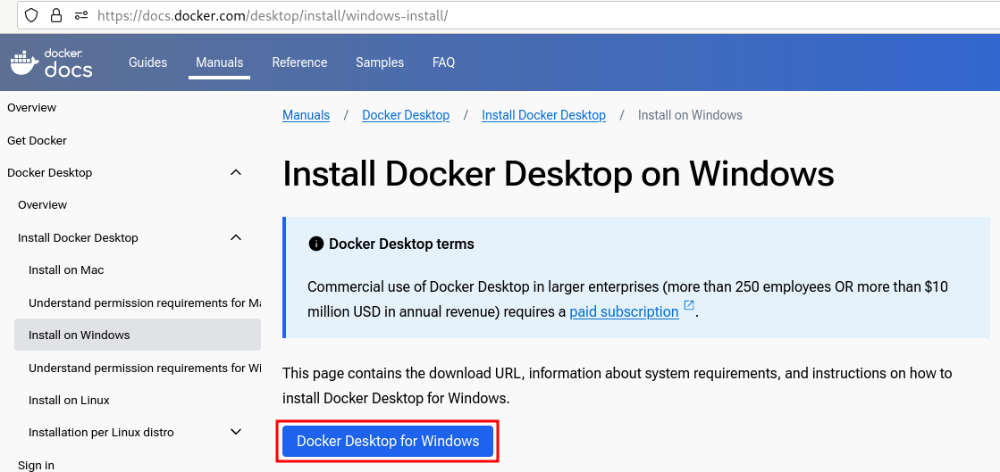
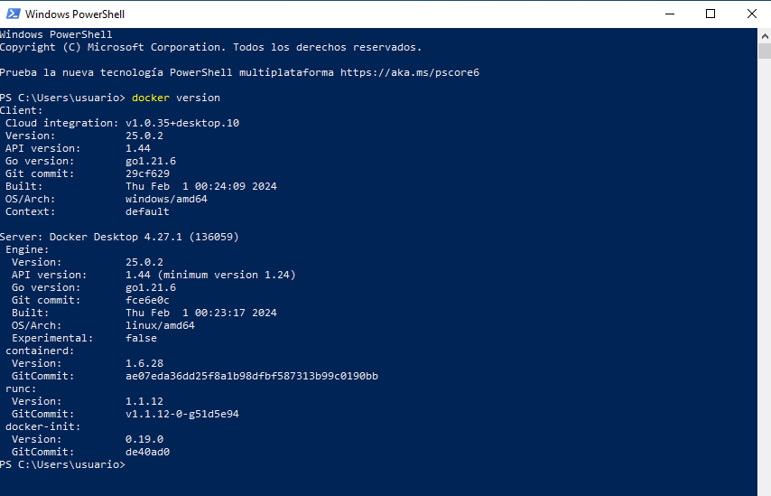

# Instalación de Docker Desktop en Windows

Podemos [instalar](https://docs.docker.com/desktop/install/windows-install/) **Docker Desktop** en distintas versiones del sistema operativo Windows:  En este apartado vamos a realizar la instalación en windows 10 Pro (versión 22H2). En sistemas Windows **Docker Desktop** instala el demonio docker o sobre una máquina linux usando WSL (Subsistema de Windows para Linux) o usando una máquina virtual ejecutada sobre el hipervisor Hyper-V. nostros vamos a usar la primera opción de instalación.

Los requisitos mínimos necesarios son:

* CPU con arquitectura de 64 bits y soporte de viirtualización en BIOS.
* WSL versión 1.1.3.0 o superior, con posibilidad de pasar a WSL 2.
* Windows 11 64-bit: Home, Pro. Enterprise o Education (versión 21H2 o superior).
* Windows 10 64-bit: Recomendado Home, Pro. Enterprise o Education (versión 22H2 build 19045 o superior), aunque se puede usar Home, Pro. Enterprise o Education (versión 21H2 build 19044 o superior).
* 4 Gb de RAM.

1. Descargamos el instalador mediante el botón de descarga de la página de instalación:

    

2. Ejecutamos el instalador haciendo doble click en `Docker Desktop Installer.exe`. De forma predeterminada, Docker Desktop se instala en `C:\Archivos de programa\Docker\Docker`.
3. Durante la instalación elegiremos la opción **Utilizar WSL 2 en lugar de Hyper-V**. Si su sistema sólo admite una de las dos opciones, no podrá seleccionar qué backend utilizar.
4. Siga las instrucciones del asistente de instalación para autorizar el instalador y proceder con la instalación.
5. Cuando la instalación se haya realizado correctamente, seleccione **Close & restart** para completar el proceso de instalación.

Después del reinicio tendremos un icono para ejecutar **Docker Desktop**, y si queremos pulsando sobre el botón **Sign in** nos podemos autentificar con nuestra cuenta de **Docker Hub**:

Por último, si accedemos una terminar ejecutando PowerShell o cmd, podemos usar el cliente Docker:

