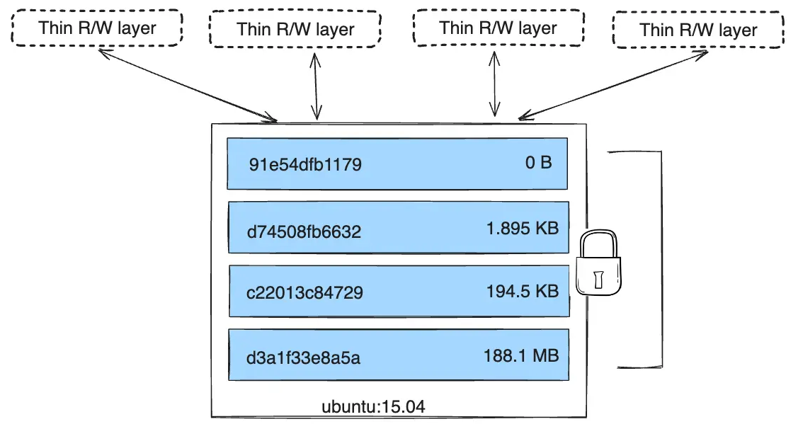

# ¿Cómo se organizan las imágenes?

Las imágenes se construyen a partir de **capas ordenadas**. 

## ¿Qué es una capa?

* Puedes pensar en una capa como un conjunto de cambios en el sistema de archivos. 
* En el proceso de creación de las imágenes, los comandos que cambian el sistema de archivos (instalaciones, modificación de ficheros, copiar ficheros,...) producen una nueva capa.
* Cada capa es sólo un conjunto de diferencias con respecto a la capa anterior.
* Cada capa se guarda en un directorio diferente.
* Cuando tomas todas las capas y las apilas, obtienes una nueva imagen que contiene todos los cambios acumulados.
* Si tienes muchas imágenes basadas en capas similares (capas que contienen sistemas operativos similares o ficheros comunes), entonces todas estas capas comunes serán almacenadas sólo una vez.

## ¿Qué ocurre cuando creamos un contenedor?

* Cuando se crea un nuevo contenedor desde una imagen, su sistema de archivos será la unión de todas las capas de la imagen. 
* Las capas de la imagen son únicamente de lectura, por lo que se añade una nueva capa de lectura-escritura. 
* Todos los cambios efectuados al contenedor específico son almacenados en esa capa.
* Esta capa se suele llamar **Capa del Contenedor**.
* Los contenedores son efímeros, por que cuando lo borramos, se borra la capa del contenedor, por lo que se pierde todos sus datos.
* Por lo tanto cuando creamos un contenedor, el almacenamiento en disco es muy pequeño, ya que las capas de la imagen desde las que se ha creado se comparten con el contenedor y la capa del contenedor en un primer momento tiene muy pocos ficheros.
* Si tenemos un contenedor creado a partir de una imagen, **esta imagen no se puede borrar** ya que sus capas forman parte del sistema de ficheros del contenedor en ejecución.

