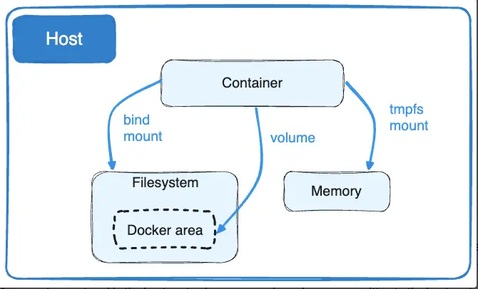

# Almacenamiento en Docker

Ante la situación anteriormente descrita Docker nos proporciona varias soluciones para persistir los datos de los contenedores. En este curso nos vamos a centrar en las dos que considero que son más importantes:

* Los **volúmenes docker**.
* Los **bind mount**
* Los **tmpfs mounts**: Almacenan en memoria la información. (No lo vamos a ver en este curso)

Los volúmenes se almacenan en una parte del sistema de archivos del host gestionado por Docker (/var/lib/docker/volumes/ en Linux). Los procesos ajenos a Docker no deben modificar esta parte del sistema de archivos. Los volúmenes son la mejor manera de persistir los datos en Docker.

    Los montajes Bind pueden almacenarse en cualquier parte del sistema anfitrión. Incluso pueden ser archivos o directorios importantes del sistema. Los procesos no Docker en el host Docker o en un contenedor Docker pueden modificarlos en cualquier momento.

    Los montajes tmpfs se almacenan sólo en la memoria del sistema anfitrión, y nunca se escriben en el sistema de archivos del sistema anfitrión.

Tanto los montajes Bind como los volúmenes pueden ser montados en contenedores usando la bandera -v o --volume, pero la sintaxis para cada uno es ligeramente diferente. Para los montajes tmpfs, puede utilizar la opción --tmpfs. Recomendamos utilizar la opción --mount tanto para contenedores como para servicios, para montajes bind, volúmenes o montajes tmpfs, ya que la sintaxis es más clara.

## Volúmenes Docker

## bind mount

## tmpfs

## Cuando usar volúmenes Docker

## Cuando usar bind mounts

## Tips for using bind mounts or volumes

