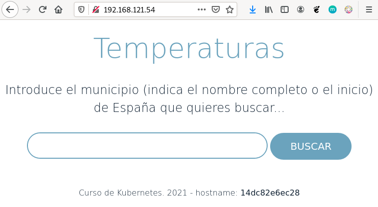

# Ejemplo 2: Despliegue de la aplicación Temperaturas

Vamos a hacer un despliegue completo de una aplicación llamada **Temperaturas**. Esta aplicación nos permite consultar la temperatura mínima y máxima de todos los municipios de España. Esta aplicación está formada por dos **microservicios**:

* `frontend`: Es una **aplicación escrita en Python** que nos ofrece una página web para hacer las búsquedas y visualizar los resultados. Este microservicio hará peticiones HTTP al segundo microservicio para obtener la información. Este microservicio ofrece el servicio en el puerto **3000/tc**p. Usaremos la imagen `iesgn/temperaturas_frontend`.
* `backend`: Es el segundo microservicio que nos ofrece un **servicio web de tipo API Restful**. A esta API Web podemos hacerles consultas sobre los municipios y sobre las temperaturas. En este caso, se utiliza el puerto **5000/tcp** para ofrecer el servicio. Usaremos la imagen `iesgn/temperaturas_backend`.

El microservicio `frontend` se conecta a `backend` usando el nombre `temperaturas-backend`, dicho de otra manera, en la imagen existe una variable de entorno llamada `TEMP_SERVER` cuyo valor por defecto es `temperaturas-backend:5000`, el nombre del contenedor y el puerto al que accede. Por lo tanto el contenedor con el micorservicio `backend` tendrá ese nombre para disponer de una resolución de nombres adecuada en el dns.

Vamos a crear una red para conectar los dos contenedores:

```bash
$ docker network create red_temperaturas
```

Para ejecutar los contenedores:

```bash
$ docker run -d --name temperaturas-backend --network red_temperaturas iesgn/temperaturas_backend

$ docker run -d -p 80:3000 --name temperaturas-frontend --network red_temperaturas iesgn/temperaturas_frontend
```

Algunas observaciones:

* Este es un tipo de aplicación, que se caracteriza por **no necesitar guardar información** para su funcionamiento. Son las denominadas **aplicaciones sin estado**, por lo tanto no necesitamos almacenamiento adicional para la aplicación.
* No es necesario mapear el puerto de `backend`, ya que no vamos a acceder desde el exterior. Sin embargo el microservicio `frontend` va a poder acceder a `backend` al puerto 5000 porque están conectado a la misma red.
* Al nombrar al contenedor de la base de datos con `temperaturas-backend` se crea una entrada en el DNS que resuelve ese nombre con la dirección IP del contenedor. Como hemos indicado, por defecto, el microservicio `frontend` usa ese nombre para acceder.



## Configuración de la aplicación Temperaturas

Como hemos indicado anteriormente, en la creación de la imagen `iesgn/temperaturas_frontend` se ha creado una variable de entorno (llamada `TEMP_SERVER`) donde se configura el nombre del servidor y el puerto de acceso del microservicio `frontend` y que debe corresponder con el nombre y el puerto del microservicio `backend`. Por defecto esta variable tiene como valor `temperaturas-backend:5000`, por lo tanto, es necesario que el contenedor del `backend` se llame `temperaturas-backend` y debe ofrecer el servicio en el puerto `5000`.

Si creamos un contenedor `backend` con otro nombre, por ejemplo:

```bash
$ docker run -d --name temperaturas-api --network red_temperaturas iesgn/temperaturas_backend
```

Tendremos que configurar la aplicación `frontend` parea que acceda al `backend` usando como nombre `temperaturas-api`, por lo tanto en la creación tendremos que definir la variable de entorno `TEMP_SERVER`, para ello ejecutamos:

```bash
$ docker run -d -p 80:3000 --name temperaturas-frontend -e TEMP_SERVER=temperaturas-api:5000 --network red_temperaturas iesgn/temperaturas_frontend
```