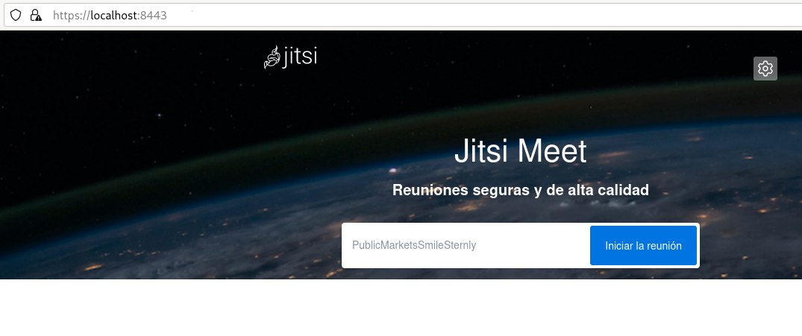
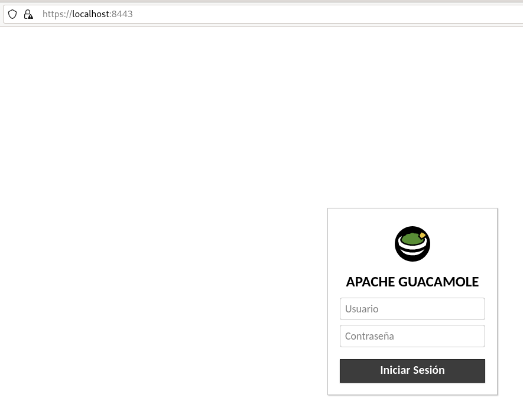

# Ejemplos reales de despliegues usando Docker Compose

En la actualidad la mayoría de los despliegues reales que se hacen con Docker, se realizan usando la herramienta **Docker Compose**, veamos algunos ejemplos:

## Despliegue de Jitsi

[Jitsi](https://meet.jit.si/) es una aplicación de videoconferencia, VoIP, y mensajería instantánea con aplicaciones nativas para iOS y Android, y con soporte para Windows, Linux y Mac OS X a través de la web.​ Es compatible con varios protocolos populares de mensajería instantánea y de telefonía, y se distribuye bajo los términos de la licencia Apache, por lo que es software libre y de código abierto. 

Podemos encontrar las instrucciones para desplegarlo con Docker en esta [página](https://github.com/jitsi/docker-jitsi-meet):

1. Descargamos los ficheros del repositorio, descomprimimos el fichero zip y accedemos al directorio:

    ```bash
    $  wget $(curl -s https://api.github.com/repos/jitsi/docker-jitsi-meet/releases/latest | grep 'zip' | cut -d\" -f4) -o jitsi.zip
    $ unzip stable-9258
    $ cd jitsi-docker-jitsi-meet-c92026a/
    ```

2. Utilizamos el fichero de variables globales para configurar la aplicación:

    ```bash
    $ cp env.example .env
    ```

    Tenemos que generar contraseñas dentro de este fichero ejecutando:

    ```bash
    $ ./gen-passwords.sh
    ```

    Además tenemos que indicar el parámetro `PUBLIC_URL` que está comentado con la URL que vamos a usar para acceder a la aplicación, por ejemplo:

    ```
    PUBLIC_URL=https://192.168.122.144:8443
    ```

3. Creamos los directorios donde vamos a guardar la información de la aplicación:

    ```bash
    $ mkdir -p ~/.jitsi-meet-cfg/{web,transcripts,prosody/config,prosody/prosody-plugins-custom,jicofo,jvb,jigasi,jibri}
    ```

4. Levantamos el escenario y accedemos a la URL que hemos indicado anteriormente desde un navegador web:

    ```bash
    $ docker compose up -d
    ```

    Se crean 4 contenedores que corresponde a cuatro componentes de Jitsi:

    * `web`: Jitsi Meet web UI, aplicación web servida por nginx.
    * `prosody`: [Prosody](https://prosody.im/), servidor XMPP
    * `jicofo`: [Jicofo], el componente JItsi COnference FOcus.
    * `jvb`: [Jitsi Videobridge](https://github.com/jitsi/jitsi-videobridge), el enrutador de vídeo.



## Despliegue de Guacamole

[Apache Guacamole](https://guacamole.apache.org/) es un cliente (aplicación web HTML5) capaz de ofrecerte funcionalidades para acceso remoto a servidores y otros equipos remotos desde cualquier parte solo con la ayuda de una conexión y un navegador web. 

Podemos instalar [Guacamole con docker](https://guacamole.apache.org/doc/gug/guacamole-docker.html) y aunque en esa página no tenemos el fichero `docker-compose.yml` podemos encontrar ejemplos de instalaciones de muchos usuarios en [GitHub](https://github.com/boschkundendienst/guacamole-docker-compose/).

Las instrucciones que tenemos que ejecutar son las siguientes:

```bash
$ git clone https://github.com/boschkundendienst/guacamole-docker-compose.git
$ cd guacamole-docker-compose
$ ./prepare.sh
$ docker compose up -d
```

El sript `prespare.sh` incializa la base de datos PostgreSQL, y genera los certificados autofirmados que se van ausar para el aceeso por https.

Si vemos el fichero [`docker-compose.yml`](https://github.com/boschkundendienst/guacamole-docker-compose/blob/master/docker-compose.yml) se van a crear cuatro contenedores:

* `guacd`: Es el demonio de Jitsi encargado de gestionar las conexiones remotas.
* `PostgreSQL`: Base de datos donde vamos a guardar la información.
* `Guacamole`: Es la aplicación web que utilizamos para gestionar las conexiones remotas.
* `nginx`: Proxy inverso para acceder a la aplicación web.

Accedemos al la URL `https://<IP_Servidor_docker>:8443` para entrar en la aplicación. El usuario y la contraseña por defecto son `guacadmin`.




