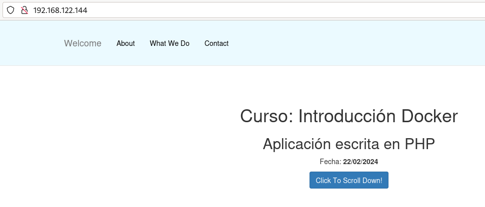

# Ejemplo 1: Construcción de imágenes con una página estática

En este ejemplo vamos a crear una imagen Docker que tenga un servidor web que nos sirva una página web estática.
Puedes encontrar los ficheros necesarios en el [Repositorio con el código de los ejemplos](https://github.com/josedom24/ejemplos_curso_docker_ow).

## Versión 1: Desde una imagen base

Tenemos un directorio, que en Docker se denomina contexto, donde tenemos el fichero `Dockerfile` y un directorio, llamado `public_html` con nuestra página web:

```bash
$ ls
Dockerfile  public_html
```

En este caso vamos a usar una imagen base de un sistema operativo sin ningún servicio. El fichero `Dockerfile` será el siguiente:

```Dockerfile
# syntax=docker/dockerfile:1
FROM debian:stable-slim
RUN apt-get update && apt-get install -y apache2 && apt-get clean && rm -rf /var/lib/apt/lists/*
WORKDIR /var/www/html/
COPY public_html .
EXPOSE 80
CMD apache2ctl -D FOREGROUND
```

* Al usar una imagen base `debian:stable-slim` tenemos que instalar los paquetes necesarios para tener el servidor web, en este caso Apache. 
* Además de la instalación del servicio hemos borrado todos los paquetes que nos hemos bajado, con esto conseguimos que la capa que va a crear la instrucción `RUN` sea lo más pequeña posible.
* A continuación añadiremos el contenido del directorio `public_html` al directorio `/var/www/html/` del contenedor, donde nos hemos posicionado con la instrucción `WORKDIR`. 
* Declaramos el puerto donde se va a ofrecer el servicio. Esta definición es sólo informativa.
* Finalmente indicamos el comando que se deberá ejecutar al crear un contenedor a partir de esta imagen: iniciamos el servidor web en segundo plano.

Para crear la imagen ejecutamos:

```bash
$ docker build -t josedom24/ejemplo1:v1 .
```

Comprobamos que la imagen se ha creado:

```bash
$ docker images
REPOSITORY             TAG                 IMAGE ID            CREATED             SIZE
josedom24/ejemplo1     v1                  8c3275799063        1 minute ago      226MB
```

Podemos ver cómo se ha creado cualquier imagen, usando el comando `docker history`:

```bash
$ docker history josedom24/ejemplo1:v1 
IMAGE          CREATED          CREATED BY                                      SIZE      COMMENT
c23cf3f2d251   11 seconds ago   CMD ["/bin/sh" "-c" "apache2ctl -D FOREGROUN…   0B        buildkit.dockerfile.v0
<missing>      11 seconds ago   EXPOSE map[80/tcp:{}]                           0B        buildkit.dockerfile.v0
<missing>      11 seconds ago   COPY public_html . # buildkit                   492kB     buildkit.dockerfile.v0
<missing>      13 seconds ago   WORKDIR /var/www/html/                          0B        buildkit.dockerfile.v0
<missing>      15 seconds ago   RUN /bin/sh -c apt-get update && apt-get ins…   112MB     buildkit.dockerfile.v0
<missing>      41 hours ago     /bin/sh -c #(nop)  CMD ["bash"]                 0B        
<missing>      41 hours ago     /bin/sh -c #(nop) ADD file:17e64d3a682fd256f…   74.8MB    
```

Y podemos crear un contenedor:

```bash
$ docker run -d -p 80:80 --name ejemplo1 josedom24/ejemplo1:v1
```

Y acceder con el navegador a nuestra página:




## Versión 2: Desde una imagen con Apache

En este caso el fichero `Dockerfile` sería el siguiente:

```Dockerfile
# syntax=docker/dockerfile:1
FROM httpd:2.4
COPY public_html /usr/local/apache2/htdocs/
EXPOSE 80
```

No necesitamos instalar nada, ya que la imagen tiene instalado el servidor web. Siguiendo la documentación de la imagen en Docker Hub sabemos que el *DocumentRoot* del servidor web es el directorio `/usr/local/apache2/htdocs/`. No es necesario indicar el `CMD` ya que por defecto el contenedor creado a partir de esta imagen ejecutará el mismo proceso que la imagen base, es decir, la ejecución del servidor web.

De forma similar, crearíamos una imagen y un contenedor:

```bash
$ docker build -t josedom24/ejemplo1:v2 .
$ docker run -d -p 80:80 --name ejemplo1 josedom24/ejemplo1:v2
```

## Versión 3: Desde una imagen con nginx

En este caso el fichero `Dockerfile` sería:

```Dockerfile
# syntax=docker/dockerfile:1
FROM nginx:1.24
COPY public_html /usr/share/nginx/html
EXPOSE 80
```

De forma similar, crearíamos una imagen y un contenedor:

```bash
$ docker build -t josedom24/ejemplo1:v3 .
$ docker run -d -p 80:80 --name ejemplo1 josedom24/ejemplo1:v3
```
