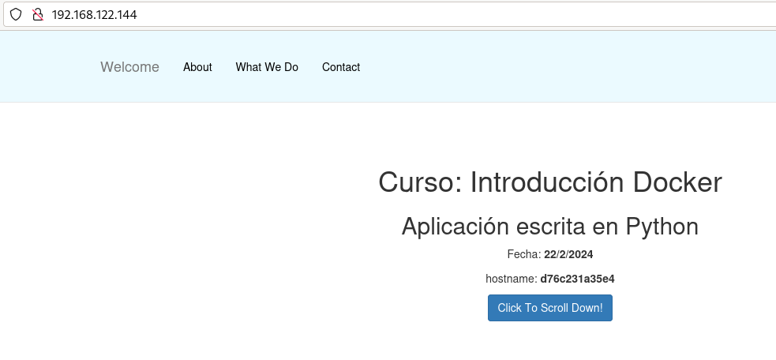

# Ejemplo 3: Construcción de imágenes con una una aplicación Python

En este ejemplo vamos a construir una imagen Docker para servir una aplicación escrita en Python utilizando el framework flask. La aplicación será servida en el puerto 3000/tcp. 

Puedes encontrar los ficheros necesarios en el [repositorio github](https://github.com/josedom24/ejemplos_curso_docker_ow).

En el contexto vamos a tener el fichero `Dockerfile` y un directorio, llamado `app` con nuestra aplicación.

En este caso vamos a usar una imagen base de un sistema operativo sin ningún servicio. El fichero `Dockerfile` será el siguiente:

```Dockerfile
# syntax=docker/dockerfile:1
FROM debian:12
RUN apt-get update && apt-get install -y python3-pip  && apt-get clean && rm -rf /var/lib/apt/lists/*
WORKDIR /usr/share/app
COPY app .
RUN pip3 install --no-cache-dir --break-system-packages -r requirements.txt
EXPOSE 3000
CMD python3 app.py
```

Algunas consideraciones:

* Sólo tenemos que instalar `pip`, que utilizaremos posteriormente para instalar los paquetes Python.
* Copiamos nuestra aplicación en cualquier directorio.
* Con `WORKDIR` nos posicionamos en el directorio indicado. Todas las instrucciones posteriores se realizarán sobre ese directorio.
* Instalamos los paquetes python con pip, que están listados en el fichero `requirements.txt`.
* El proceso que se va a ejecutar por defecto al iniciar el contenedor será `python3 app.py` que arranca un servidor web en el puerto 3000/tcp ofreciendo la aplicación.

Para crear la imagen ejecutamos:

```bash
$ docker build -t josedom24/ejemplo3:v1 .
```

Comprobamos que la imagen se ha creado:

```bash
$ docker images
REPOSITORY             TAG                 IMAGE ID            CREATED             SIZE
josedom24/ejemplo3     v1                  8c3275799063        1 minute ago      226MB
```

Y podemos crear un contenedor:

```bash
$ docker run -d -p 80:3000 --name ejemplo2 josedom24/ejemplo3:v1
```

Y acceder con el navegador a nuestra página:



## Versión 2: Desde una imagen con python instalado

En este caso el dichero `Dockerfile` podría ser de esta manera:

```Dockerfile
# syntax=docker/dockerfile:1
FROM python:3.12.1-bookworm
WORKDIR /usr/share/app
COPY app .
RUN pip install --no-cache-dir -r requirements.txt
EXPOSE 3000
CMD python app.py
```