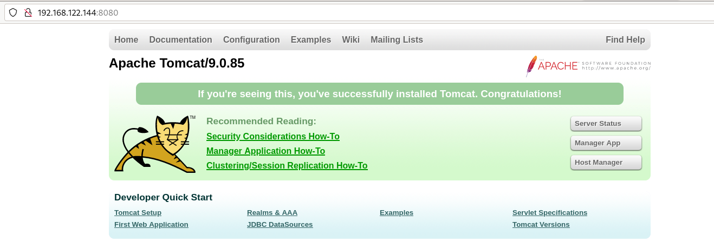

# Ejemplo 5: Configuración de imágenes con una aplicación Java

En este ejemplo vamos a estudiar como podemos trabajar con el Servidor de Aplicaciones Apache Tomcat. Para hacer las pruebas vamos a usar la imagen Docker `bitnami/tomcat` cuya [documentación](https://hub.docker.com/r/bitnami/tomcatJava) puedes encontrar en Docker Hub.

En primer lugar vamos a crear un contenedor Docker desde la imagen `bitnami/tomcat` y vamos a hacer un despliegue de un fichero war de forma manual. Además vamos a configurar el contenedor para indicar el usuario y la contraseña que nos va a permitir acceder ala web de administración de Tomcat. Para ello ejecutamos:

```bash
$ docker run -d -p 8080:8080 -e TOMCAT_USERNAME=admin -e TOMCAT_PASSWORD=my-password --name mytomcat bitnami/tomcat:9.0
```

Podemos acceder desde un navegador web, y entraríamos en la página principal de Tomcat:



Si accedemos a la URL `/manager/html` accedemos a la zona de administración. Para acceder tendremos que indicar el nombre y la contraseña que hemos indicado en las variables de entorno:


 Podríamos hacer el despliegue de la aplicación de ejemplo que tenemos desde la zona de administración, pero vamos copiarlo directamente al directorio de despliegue. en esta imagen dicho directorio es `/opt/bitnami/tomcat/webapps` o de manera más sencilla al enlace simbólico `/app`. De esta manera:

 ```bash
$ docker cp app.war mytomcat:/app
```

Para acceder a la aplicación podemos acceder a la url `/app`:


Por último es muy sencillo crear una nueva imagen con nuestra aplicación desplegada. El fichero `Dockerfiile` sería de la siguiente forma:

```Dockerfile
# syntax=docker/dockerfile:1
FROM bitnami/tomcat:9.0
COPY app.war /opt/bitnami/tomcat/webapps
```

Creamos la nueva imagen, creamos un nuevo contenedor:

```bash
$ docker build -t josedom24/app_java:v1 .
$ docker run -d -p 8081:8080 -e TOMCAT_PASSWORD=my-password --name app_java josedom24/app_java:v1
```

Finalmente podemos acceder a la aplicación utilizando un navegador web:
