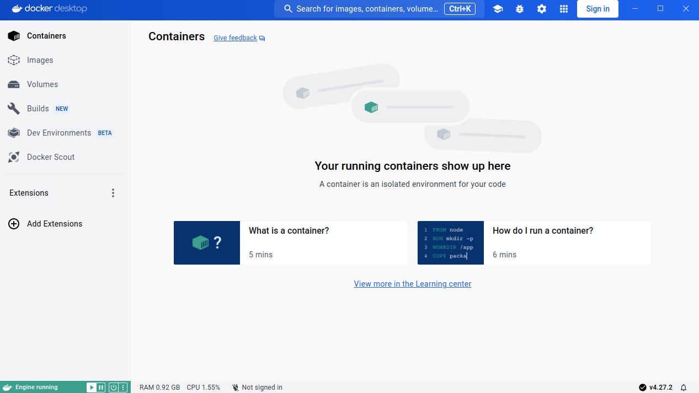

# Introducción a la interfaz de Docker Desktop

Cuando abrimos la aplicación Docker Desktop, tenemos a nuestra disposición una aplicación gráfica llamada Docker Dashboard:

## Funciones principales

* **Contenedores**:

    * La vista de contenedores nos permite gestionar nuestras contenedores.
    * Podemos gestionar el ciclo de vida (inicio, parada, reinicio,...).
    * Nos permite realizar tareas comunes sobre los contenedores: inspeccionar, acceder al terminar, ver los logs, ...

* **Imágenes**:

    * Esta vista nos permite gestionar las imágenes.
    * Podemos ver las imágenes que tenemos en el registro local y nuestras imágenes en docker Hub si estamos logueados.
    * Nos permite ejecutar contenedores a partir de las imágenes.
    * Nos muestra un resumen de las vulnerabilidades de las imágenes.

* **Volúmenes**:

    * Nos permite ver la lista de volúmenes Docker que tenemos creados.
    * También nos permite crear nuevos volúmenes.

* **Builds**:

    * En esta vista podemos inspeccionar tu historial de construcciones de imágenes.
    * Nos permite gestionar las construcciones en curso.

## Otras funciones

* **Menú Configuración** para configurar los ajustes de Docker Desktop.
* **Menú Solucionar problemas** para depurar y realizar operaciones de reinicio. 
* **Recibir notificaciones** sobre nuevas versiones, actualizaciones del progreso de la instalación y mucho más en el centro de notificaciones. 
* **Centro de aprendizaje** le permite acceder a documentación sobre Docker.
* **Dev Environments**: Nos permiten crean entornos de desarrollo que se ejecutan en contenedores.
* **Docker Scout**: Nos permite examinar imágenes para encontrar posibles vulnerabilidades.

## Panel de búsqueda

Podemos buscar:
* Cualquier contenedor o aplicación Compose en tu sistema local. Puede ver un resumen de las variables de entorno asociadas o realizar acciones rápidas, como iniciar, detener o eliminar.
* Imágenes públicas de Docker Hub, imágenes locales e imágenes de repositorios remotos (repositorios privados de organizaciones de las que formas parte en Hub). Dependiendo del tipo de imagen que selecciones, puedes extraer la imagen por etiqueta, ver la documentación, ir a Docker Hub para obtener más detalles o ejecutar un nuevo contenedor utilizando la imagen.
* Extensiones. Desde aquí, puede obtener más información sobre la extensión e instalarla con un solo clic. O, si ya tienes una extensión instalada, puedes abrirla directamente desde los resultados de la búsqueda.
* Volúmenes. Desde aquí puedes ver el contenedor asociado.
* Documentación. Encuentra ayuda en la documentación oficial de Docker directamente desde Docker Desktop.

